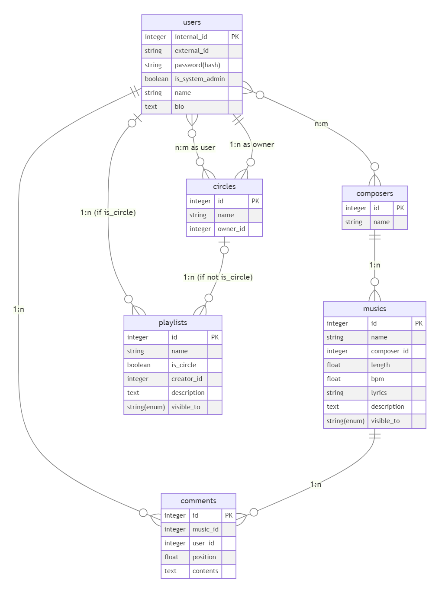

# 音楽管理・配信サービスの論理設計

**計算機科学実験及演習 4: データベース 課題 2 レポート**
**京都大学工学部情報学科 計算機科学コース 3 年生 王篤遥**
**学生番号: 1029332225, 提出日: 2023-10-06**

#### 概念モデル

課題 1 から変数名やデータ型をより正確なものに変更しました。

#### 論理モデル

概念モデルから適切に中間テーブルを増やし、一貫性制約を追加することで、完成した関係スキーマは下図の通りです。

概念モデルから新たに追加されたテーブルについて説明します。

##### ユーザー・作曲者名義中間テーブル (user_composer_members)

ユーザーと作曲者名義の間にあった many-to-many 関係を解消して、外部キー制約を記述するためのテーブルです。

- `user_id` PK: ユーザーの識別 ID
- `composer_id` PK: 作曲者名義の識別 ID
- `deleted_at`: 論理削除のための属性。削除された場合にレコードごと削除するのではなく、ここに削除時刻を格納する。

##### ユーザー・サークル中間テーブル (user_circle_members)

ユーザーとサークルの間にあった many-to-many 関係を解消して、外部キー制約を記述するためのテーブルです。

- `user_id` PK: ユーザーの識別 ID
- `circle_id` PK: サークルの識別 ID
- `joined_at`: サークルに追加された時刻
- `deleted_at`: 論理削除のための属性。削除された場合にレコードごと削除するのではなく、ここに削除時刻を格納する。

##### 個人プレイリスト中間テーブル (user_playlist_relations)

プレイリストが持っていた個人・サークルという多相性を解消して、外部キー制約を記述するためのテーブルです。

- `user_id` PK: ユーザーの識別 ID
- `playlist_id` PK: プレイリストの識別 ID
- `deleted_at`: 論理削除のための属性。削除された場合にレコードごと削除するのではなく、ここに削除時刻を格納する。

##### サークルプレイリスト中間テーブル (circle_playlist_relations)

プレイリストが持っていた個人・サークルという多相性を解消して、外部キー制約を記述するためのテーブルです。

- `circle_id` PK: サークルの識別 ID
- `playlist_id` PK: プレイリストの識別 ID
- `deleted_at`: 論理削除のための属性。削除された場合にレコードごと削除するのではなく、ここに削除時刻を格納する。

#### 関係スキーマにおける自明でない関数従属性集合

この関係スキーマにおける自明でない関数従属性を、従属性が成立する理由ごとに分類したものが以下の通りです。

##### 主キーから他の属性への関数従属性

主キーはその定義から他の属性を一意に定めるので、自明でない関数従属性を持ちます。

- `users` において: `internal_id -> external_id, password, is_system_admin, name, bio`
- `composers` において: `id -> name`
- `circles` において: `id -> name, owner_id`
- `musics` において: `id -> name, composer_id, length, bpm, lyrics, description, visible_to`
- `playlists` において: `id -> name, description, visible_to`
- `comments` において: `id -> music_id, user_id, position, contents`
- `user_composer_members` において: `user_id, composer_id -> deleted_at`
- `user_circle_members` において: `user_id, circle_id -> joined_at, deleted_at`
- `user_playlist_relations` において: `user_id, playlist_id -> deleted_at`
- `circle_playlist_relations` において: `circle_id, playlist_id -> deleted_at`

##### 非主キーで unique 制約が課されている属性から他の属性への関数従属性

unique 制約が課されている非主キーは候補キーなので、他の属性を一意に定め、自明でない関数従属性を持ちます。

- `users` において: `external_id -> internal_id, password, is_system_admin, name, bio`
- `circle_playlist_relations` において: `playlist_id -> circle_id, deleted_at`
- `user_playlist_relations` において: `playlist_id -> user_id, deleted_at`

##### その他の候補キーから他の属性への関数従属性

他にも候補キーがあれば、自明でない関数従属性を持ちますが、この関係スキーマには unique 制約で定めたもの以外に候補キーはありません。

##### 候補キーではない属性から他の属性への関数従属性

候補キーではない属性から他の属性への関数従属性もありません。

#### 関係スキーマにおける自明でない多値従属性集合

この関係スキーマにおける自明でない (関数従属性以外の) 多値従属性はありません。