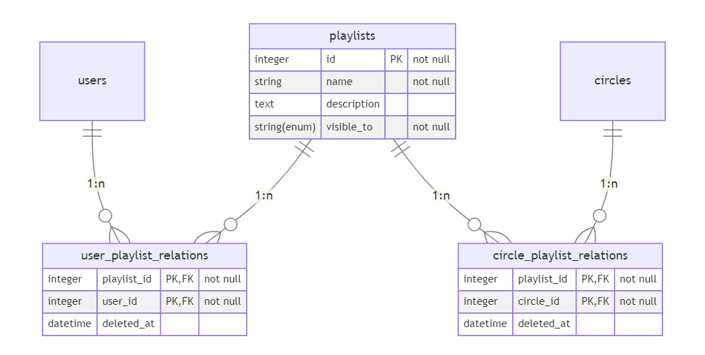
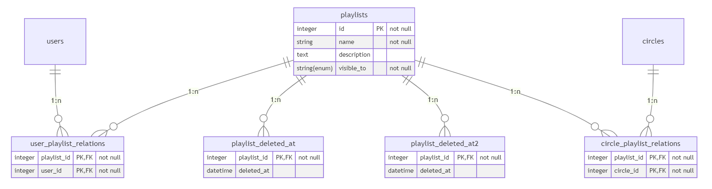

# 音楽管理・配信サービスの関係スキーマをPostgreSQL上で実装する

**計算機科学実験及演習 4: データベース 課題 4 レポート**
**京都大学工学部情報学科 計算機科学コース 3 年生 王篤遥**
**学生番号: 1029332225, 提出日: 2023-10-19**

#### 論理モデル

課題 3 にて完成した関係スキーマは下図の通りです。


#### キーの指定により保持できる関数従属性や正規形

主キーはその定義から他の属性を一意に定めます。
各関係において、主キーの指定により以下の関数従属性が保持されました。

- `users` において: `internal_id -> external_id, password, is_system_admin, name, bio`
- `composers` において: `id -> name`
- `circles` において: `id -> name, owner_id`
- `musics` において: `id -> name, composer_id, length, bpm, lyrics, description, visible_to`
- `playlists` において: `id -> name, description, visible_to, deleted_at`
- `comments` において: `id -> music_id, user_id, position, contents`
- `user_composer_members` において: `user_id, composer_id -> deleted_at`
- `user_circle_members` において: `user_id, circle_id -> joined_at, deleted_at`
- `user_playlist_relations` において: `playlist_id -> user_id`
- `circle_playlist_relations` において: `playlist_id -> circle_id`

非主キーで unique 制約が課されている属性は、候補キーとなるので、以下の関数従属性を保持します。

- `users` において: `external_id -> internal_id, password, is_system_admin, name, bio`

この関係スキーマでは、中間テーブルでない関係はいずれも内部的な ID を持たせてそれを (unique 制約のある) 主キーとしているため、
非キーが引き起こす部分従属性や推移従属性を容易に排除でき、BCNF であることが容易に確認できるようになっています。

課題 3 においては、以下の関係スキーマの一部が問題となりました。



`circle_playlist_relations` と `user_playlist_relations` において以下の部分従属性が確認されました。

- `circle_playlist_relations` において: `playlist_id -> deleted_at`
- `user_playlist_relations` において: `playlist_id -> deleted_at`

それは、その 2 つのテーブルにおいて注目する主キーが例えば `user_id, playlist_id` のような複合キーだったことが原因です。
そこで、注目する主キーをもとより unique 制約のかかっている `playlist_id` のみにすることで、上記の部分従属性をそれぞれ別の関係に保持させるようにして、第二正規形が満たされました。



さらに、上記の関係スキーマにおける 2 つの `playlist_deleted_at` が互いに (別の中間テーブルから作られたことから) 排反であることに着目して、そもそも属性 `deleted_at` を `playlists` に保持させるという処理を行って、本レポート冒頭に提示した関係スキーマが完成しました。

#### PostgreSQL 上での関係スキーマの実装

以上の関係スキーマを PostgreSQL 上で実装します。発行した SQL 文は以下の通りです。

```sql
CREATE TABLE users (
    internal_id serial PRIMARY KEY NOT NULL,
    external_id varchar(36) UNIQUE NOT NULL,
    password text NOT NULL,
    is_system_admin boolean DEFAULT false NOT NULL,
    name varchar(1080) NOT NULL,
    bio text
);

CREATE TABLE composers (
    id serial PRIMARY KEY NOT NULL,
    name varchar(1080) NOT NULL
);

CREATE TABLE user_composer_members (
    user_id integer REFERENCES users(internal_id) NOT NULL,
    composer_id integer REFERENCES composers(id) NOT NULL,
    deleted_at timestamp,
    PRIMARY KEY (user_id, composer_id)
);

CREATE TABLE circles (
    id serial PRIMARY KEY NOT NULL,
    name varchar(1080) NOT NULL,
    owner_id integer REFERENCES users(internal_id) NOT NULL
);

CREATE TABLE user_circle_members (
    user_id integer REFERENCES users(internal_id) NOT NULL,
    circle_id integer REFERENCES circles(id) NOT NULL,
    joined_at timestamp NOT NULL,
    deleted_at timestamp,
    PRIMARY KEY (user_id, circle_id)
);

CREATE TABLE musics (
    id serial PRIMARY KEY NOT NULL,
    name varchar(1080) NOT NULL,
    composer_id integer REFERENCES composers(id) NOT NULL,
    length real,
    bpm real,
    lyrics text,
    description text,
    visible_to varchar(36) NOT NULL
);

CREATE TABLE playlists (
    id serial PRIMARY KEY NOT NULL,
    name varchar(1080) NOT NULL,
    description text,
    visible_to varchar(36) NOT NULL,
    deleted_at timestamp
);

CREATE TABLE user_playlist_relations (
    playlist_id integer REFERENCES playlists(id) PRIMARY KEY NOT NULL,
    user_id integer REFERENCES users(internal_id) NOT NULL
);

CREATE TABLE circle_playlist_relations (
    playlist_id integer REFERENCES playlists(id) PRIMARY KEY NOT NULL,
    circle_id integer REFERENCES circles(id) NOT NULL
);

CREATE TABLE comments (
    id serial PRIMARY KEY NOT NULL,
    music_id integer REFERENCES musics(id) NOT NULL,
    user_id integer REFERENCES users(internal_id) NOT NULL,
    position real,
    contents text NOT NULL
);

```

この関係スキーマ定義は、ER 図で定義した関係スキーマに合致しています。よって、各関係において主キーが他の属性への関数従属性を保持します。また、非主キーが保持する関数従属性は以下の 1 つのみです。

- `users` において: `external_id -> internal_id, password, is_system_admin, name, bio`

これは、やはり `external_id` に unique 制約が課されているためです。

#### PostgreSQL 上でのデータの挿入

以上にて実装した関係スキーマにデータを挿入していきます。発行した SQL 文は以下の通りです。

```sql
INSERT INTO users (external_id, password, is_system_admin, name, bio)
VALUES ('admin', 'passwordadmin', true, 'Admin User', 'I am the admin');

INSERT INTO users (external_id, password, is_system_admin, name, bio)
VALUES ('B2_54cmU', 'password', false, 'Ao Takeuma', 'ongaku wo suru 21 sai');

INSERT INTO users (external_id, password, is_system_admin, name)
VALUES ('user1', 'password', false, 'User1');

INSERT INTO users (external_id, password, is_system_admin, name, bio)
VALUES ('user2', 'password', false, 'User2', '');

INSERT INTO users (external_id, password, is_system_admin, name, bio)
VALUES ('user3', 'password123', false, 'User3', 'bio3');

INSERT INTO composers (name)
VALUES ('Ao Takeuma');

INSERT INTO composers (name)
VALUES ('Omnibus');

INSERT INTO composers (name)
VALUES ('Composer1');

INSERT INTO composers (name)
VALUES ('Composer2');

INSERT INTO user_composer_members (user_id, composer_id)
VALUES (3, 1);

INSERT INTO user_composer_members (user_id, composer_id)
VALUES (4, 2);

INSERT INTO user_composer_members (user_id, composer_id)
VALUES (5, 2);

INSERT INTO user_composer_members (user_id, composer_id)
VALUES (6, 2);

INSERT INTO user_composer_members (user_id, composer_id)
VALUES (4, 3);

INSERT INTO user_composer_members (user_id, composer_id, deleted_at)
VALUES (5, 4, '2023-01-15 14:30:00');

INSERT INTO circles (name, owner_id)
VALUES ('Kitchon', 1);

INSERT INTO circles (name, owner_id)
VALUES ('Circle1', 4);

INSERT INTO user_circle_members (user_id, circle_id, joined_at)
VALUES (1, 1, '2023-01-01 13:00:00');

INSERT INTO user_circle_members (user_id, circle_id, joined_at)
VALUES (3, 1, '2023-01-01 13:00:00');

INSERT INTO user_circle_members (user_id, circle_id, joined_at, deleted_at)
VALUES (4, 1, '2023-01-01 13:00:00', '2023-03-31 22:00:00');

INSERT INTO user_circle_members (user_id, circle_id, joined_at)
VALUES (4, 2, '2023-01-01 14:00:00');

INSERT INTO user_circle_members (user_id, circle_id, joined_at)
VALUES (5, 1, '2023-04-01 14:00:00');

INSERT INTO user_circle_members (user_id, circle_id, joined_at, deleted_at)
VALUES (6, 1, '2023-02-01 14:00:00', '2023-02-28 23:00:00');

INSERT INTO musics (name, composer_id, length, bpm, lyrics, description, visible_to)
VALUES ('Connection!!!', 1, 190.3, 130, 'VERY NICE LYRICS HERE', 'future bass desu.', 'global');

INSERT INTO musics (name, composer_id, length, bpm, lyrics, description, visible_to)
VALUES ('Born', 1, 310, 88, 'Ubugoe wo ageta', 'piano ballad desu.', 'circle');

INSERT INTO musics (name, composer_id, length, lyrics, description, visible_to)
VALUES ('Omnibus Song', 2, 240.4, 'Lyrics of Omnibus Song', 'Description of Omnibus Song.', 'global');

INSERT INTO musics (name, composer_id, length, bpm, visible_to)
VALUES ('Song1', 3, 30, 188, 'circle');

INSERT INTO musics (name, composer_id, visible_to)
VALUES ('Song2', 4, 'private');

INSERT INTO playlists (name, description, visible_to)
VALUES ('Ao Music Collection', 'My songs', 'global');

INSERT INTO playlists (name, description, visible_to)
VALUES ('MonthlyKitchon200', 'Kitchon songs', 'circle');

INSERT INTO playlists (name, visible_to)
VALUES ('Good music1', 'global');

INSERT INTO playlists (name, visible_to, deleted_at)
VALUES ('Good music2', 'private', '2023-08-31 12:00:00');

INSERT INTO user_playlist_relations (playlist_id, user_id)
VALUES (1, 3);

INSERT INTO circle_playlist_relations (playlist_id, circle_id)
VALUES (2, 1);

INSERT INTO user_playlist_relations (playlist_id, user_id)
VALUES (3, 4);

INSERT INTO user_playlist_relations (playlist_id, user_id)
VALUES (4, 5);

INSERT INTO comments (music_id, user_id, position, contents)
VALUES (1, 4, 50.4, 'Iinjane?');

INSERT INTO comments (music_id, user_id, position, contents)
VALUES (1, 4, 60.4, 'Yokuneewa');

INSERT INTO comments (music_id, user_id, position, contents)
VALUES (1, 5, 0.4, 'upotsu');

INSERT INTO comments (music_id, user_id, contents)
VALUES (1, 6, 'This is a good kawaii future bass!');

INSERT INTO comments (music_id, user_id, position, contents)
VALUES (3, 1, 10.0, 'Comment to Omnibus Song by admin');

INSERT INTO comments (music_id, user_id, contents)
VALUES (4, 4, 'Comment to Song1 by user1');

INSERT INTO comments (music_id, user_id, position, contents)
VALUES (5, 5, 5, 'Comment to Song2 by user2');

INSERT INTO comments (music_id, user_id, position, contents)
VALUES (5, 5, 15, 'Comment to Song2 by user2');
```

データを挿入した表を一部を出力すると、以下の通りとなりました。

```sql
SELECT * FROM users;
 internal_id | external_id |   password    | is_system_admin |    name    |          bio
-------------+-------------+---------------+-----------------+------------+-----------------------
           1 | admin       | passwordadmin | t               | Admin User | I am an admin
           3 | B2_54cmU    | password      | f               | Ao Takeuma | ongaku wo suru 21 sai
           4 | user1       | password      | f               | User1      |
           5 | user2       | password      | f               | User2      |
           6 | user3       | password123   | f               | User3      | bio3
(5 行)

SELECT * FROM circles;
 id |  name   | owner_id
----+---------+----------
  1 | Kitchon |        1
  2 | Circle1 |        4
(2 行)

SELECT * FROM user_circle_members;
 user_id | circle_id |      joined_at      |     deleted_at
---------+-----------+---------------------+---------------------
       1 |         1 | 2023-01-01 13:00:00 |
       3 |         1 | 2023-01-01 13:00:00 |
       4 |         1 | 2023-01-01 13:00:00 | 2023-03-31 22:00:00
       4 |         2 | 2023-01-01 14:00:00 |
       5 |         1 | 2023-04-01 14:00:00 |
       6 |         1 | 2023-02-01 14:00:00 | 2023-02-28 23:00:00
(6 行)

SELECT * FROM user_composer_members;
 user_id | composer_id |     deleted_at
---------+-------------+---------------------
       3 |           1 |
       4 |           2 |
       5 |           2 |
       6 |           2 |
       4 |           3 |
       5 |           4 | 2023-01-15 14:30:00
(6 行)

SELECT * FROM comments LIMIT 5;
 id | music_id | user_id | position |              contents
----+----------+---------+----------+------------------------------------
  1 |        1 |       4 |     50.4 | Iinjane?
  2 |        1 |       4 |     60.4 | Yokuneewa
  3 |        1 |       5 |      0.4 | upotsu
  4 |        1 |       6 |          | This is a good kawaii future bass!
  5 |        3 |       1 |       10 | Comment to Omnibus Song by admin
(5 行)
```