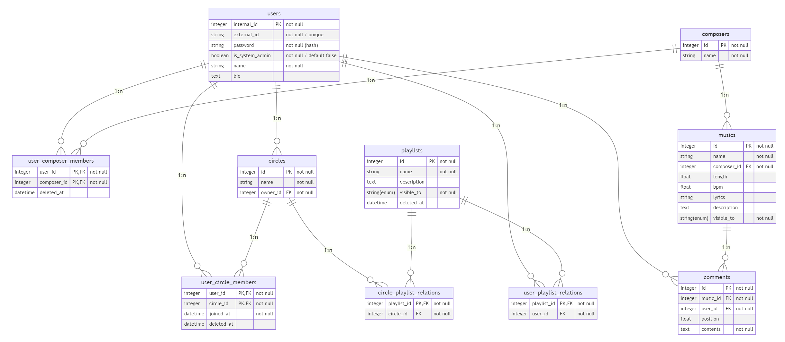

# 音楽管理・配信サービスのデータベースへのクエリをPostgreSQL上で実装する

**計算機科学実験及演習 4: データベース 課題 5 レポート**

**京都大学工学部情報学科 計算機科学コース 3 年生 王篤遥**

**学生番号: 1029332225, 提出日: 2023-10-19**

#### 論理モデル

課題 3 にて完成した関係スキーマは下図の通りです。



#### 関係代数の射影および選択に対応するSQL文

- DJ のセットリストを作成するために、楽曲 (musics) の名前と、その楽曲の長さと BPM を取得する

```sql
SELECT name, length, bpm FROM musics;
```

結果は以下の通りです。

```
     name      | length | bpm
---------------+--------+-----
 Connection!!! |  190.3 | 130
 Born          |    310 |  88
 Omnibus Song  |  240.4 |
 Song1         |     30 | 188
 Song2         |        |
(5 行)
```

- DJ のセットリストを作成するために、BPM が 130 以上の楽曲 (musics) を取得する

```sql
SELECT * FROM musics WHERE bpm >= 130;
```

結果は以下の通りです。

```
 id |     name      | composer_id | length | bpm |        lyrics         |    description    | visible_to
----+---------------+-------------+--------+-----+-----------------------+-------------------+------------
  1 | Connection!!! |           1 |  190.3 | 130 | VERY NICE LYRICS HERE | future bass desu. | global
  4 | Song1         |           3 |     30 | 188 |                       |                   | circle
(2 行)
```

#### 関係代数の自然結合に対応するSQL文

- ユーザーとサークルの両方に紐づいてしまった、論理的にバグのあるプレイリストの有無を確認するために、`user_playlist_relations` と `circle_playlist_relations` を結合する

```sql
SELECT * FROM user_playlist_relations NATURAL JOIN circle_playlist_relations;
```

結果は以下の通りです。

```
 playlist_id | user_id | circle_id
-------------+---------+-----------
(0 行)
```

この 2 つの関係は、各プレイリストが必ずユーザーかサークルのいずれかのみに紐づいていることを記述するための関係ですので、
同じ `playlist_id` に `user_id` と `circle_id` が同時に与えられてはいけません。よって空となるのが正しいです。

#### UNIONを含むSQL文

- ユーザーに楽曲の情報を書いてもらうよう促すために、歌詞 (lyrics) か説明 (description) が空である楽曲を取得する

```sql
SELECT * FROM ((SELECT * FROM musics WHERE lyrics IS NULL) UNION (SELECT * FROM musics WHERE description IS NULL));
```

結果は以下の通りです。

```
 id | name  | composer_id | length | bpm | lyrics | description | visible_to
----+-------+-------------+--------+-----+--------+-------------+------------
  4 | Song1 |           3 |     30 | 188 |        |             | circle
  5 | Song2 |           4 |        |     |        |             | private
(2 行)
```

#### EXCEPTを含むSQL文

- サークルにおいて作曲を始めていないユーザーを割り出すために、サークルに所属するが、作曲者名義を持っていないユーザーを取得する

```sql
SELECT name FROM (
    ((SELECT user_id FROM user_circle_members) EXCEPT (SELECT user_id FROM user_composer_members))
    LEFT JOIN users ON user_id = users.internal_id
);
```

結果は以下の通りです。

```
    name
------------
 Admin User
(1 行)
```

#### DISTINCTを含むSQL文

- アクティブなユーザーを分析するために、コメントを一つでも残しているユーザーを取得する

```sql
SELECT DISTINCT user_id, name FROM comments LEFT JOIN users ON user_id = users.internal_id;
```

結果は以下の通りです。

```
 user_id |    name
---------+------------
       4 | User1
       1 | Admin User
       5 | User2
       6 | User3
(4 行)
```

#### 集合関数(COUNT,SUM,AVG,MAX,MIN)を用いたSQL文

- アクティブなユーザーについて更に分析をするために、各ユーザーのコメント回数を取得する

```sql
SELECT u.internal_id AS user_id, u.name AS user_name, COUNT(c.id) AS comment_count
FROM users u LEFT JOIN comments c ON u.internal_id = c.user_id
GROUP BY u.internal_id, u.name;
```

結果は以下の通りです。

```
 user_id | user_name  | comment_count
---------+------------+---------------
       4 | User1      |             3
       6 | User3      |             1
       3 | Ao Takeuma |             0
       1 | Admin User |             1
       5 | User2      |             3
(5 行)
```

- 作曲者が投稿楽曲をすべてまとめたアルバムを作成しようとしています。そのアルバムの長さを得るために、各作曲者名義ごとの楽曲の長さの総和を取得する

```sql
SELECT c.id AS composer_id, c.name AS composer_name, SUM(m.length) AS album_length
FROM composers c LEFT JOIN musics m ON c.id = m.composer_id
GROUP BY c.id, c.name;
```

結果は以下の通りです。

```
 composer_id | composer_name | album_length
-------------+---------------+--------------
           3 | Composer1     |           30
           4 | Composer2     |
           2 | Omnibus       |        240.4
           1 | Ao Takeuma    |        500.3
(4 行)
```

- 楽曲ごとのインプレッションについて分析をするために、各楽曲に付いたユーザーのコメント数についての平均・最小値・最大値などの統計情報を得る

```sql
SELECT AVG(comment_count) AS count_average, MAX(comment_count) AS count_max, MIN(comment_count) AS count_min FROM (
    SELECT m.id AS music_id, COUNT(c.id) AS comment_count
    FROM musics m LEFT JOIN comments c ON m.id = c.music_id
    GROUP BY m.id
);
```

結果は以下の通りです。

```
   count_average    | count_max | count_min
--------------------+-----------+-----------
 1.6000000000000000 |         4 |         0
(1 行)
```

#### 副質問(sub query)を含むSQL文

- ユーザーの検索機能を実装しようとしています。"C" で始まるサークルに所属するユーザーの名前を取得する

```sql
SELECT u.name AS user_name
FROM users u
WHERE u.internal_id IN (
    SELECT uc.user_id
    FROM circles c LEFT JOIN user_circle_members uc ON c.id = uc.circle_id
    WHERE c.name LIKE 'C%'
);
```

結果は以下の通りです。

```
 user_name
-----------
 User1
(1 行)
```

#### UPDATEを含むSQL文

- メンバーがサークルを脱退しました。それを記録するために、あるユーザーのサークル脱退時刻を `deleted_at` に記録する

```sql
UPDATE user_circle_members
SET deleted_at = NOW()
WHERE user_id = 5 AND circle_id = 1;
```

UPDATE の実行前に一度

```sql
SELECT * FROM user_circle_members;
```

を実行して確認したら以下の通りでした。

```
 user_id | circle_id |      joined_at      |         deleted_at
---------+-----------+---------------------+----------------------------
       1 |         1 | 2023-01-01 13:00:00 |
       3 |         1 | 2023-01-01 13:00:00 |
       4 |         1 | 2023-01-01 13:00:00 | 2023-03-31 22:00:00
       4 |         2 | 2023-01-01 14:00:00 |
       5 |         1 | 2023-04-01 14:00:00 |
       6 |         1 | 2023-02-01 14:00:00 | 2023-02-28 23:00:00
(6 行)
```

UPDATE を実行した結果、`UPDATE 1` と返されました。もう一度

```sql
SELECT * FROM user_circle_members;
```

を実行した結果は以下の通りです。

```
 user_id | circle_id |      joined_at      |         deleted_at
---------+-----------+---------------------+----------------------------
       1 |         1 | 2023-01-01 13:00:00 |
       3 |         1 | 2023-01-01 13:00:00 |
       4 |         1 | 2023-01-01 13:00:00 | 2023-03-31 22:00:00
       4 |         2 | 2023-01-01 14:00:00 |
       6 |         1 | 2023-02-01 14:00:00 | 2023-02-28 23:00:00
       5 |         1 | 2023-04-01 14:00:00 | 2023-10-20 15:51:16.925099
(6 行)
```

#### ORDER BYを含むSQL文

DJ のプレイリストを作るために、楽曲を BPM 順で並べる

```sql
SELECT * FROM musics ORDER BY bpm;
```

結果は以下の通りです。

```
 id |     name      | composer_id | length | bpm |         lyrics         |         description          | visible_to
----+---------------+-------------+--------+-----+------------------------+------------------------------+------------
  2 | Born          |           1 |    310 |  88 | Ubugoe wo ageta        | piano ballad desu.           | circle
  1 | Connection!!! |           1 |  190.3 | 130 | VERY NICE LYRICS HERE  | future bass desu.            | global
  4 | Song1         |           3 |     30 | 188 |                        |                              | circle
  3 | Omnibus Song  |           2 |  240.4 |     | Lyrics of Omnibus Song | Description of Omnibus Song. | global
  5 | Song2         |           4 |        |     |                        |                              | private
(5 行)
```

#### CREATE VIEWを含むSQL文

- アクティブなユーザーにの分析を動的にその都度行うために、ユーザーごとのコメント数のカウントをビューとして実装する

```sql
CREATE VIEW user_comment_count AS
SELECT u.internal_id AS user_id, u.name AS user_name, COUNT(c.id) AS comment_count
FROM users u LEFT JOIN comments c ON u.internal_id = c.user_id
GROUP BY u.internal_id, u.name;
```

その後、

```sql
SELECT * FROM user_comment_count;
```

を実行するだけで、ユーザーのコメント数分析が得られます。

```
 user_id | user_name  | comment_count
---------+------------+---------------
       4 | User1      |             3
       6 | User3      |             1
       3 | Ao Takeuma |             0
       1 | Admin User |             1
       5 | User2      |             3
(5 行)
```
